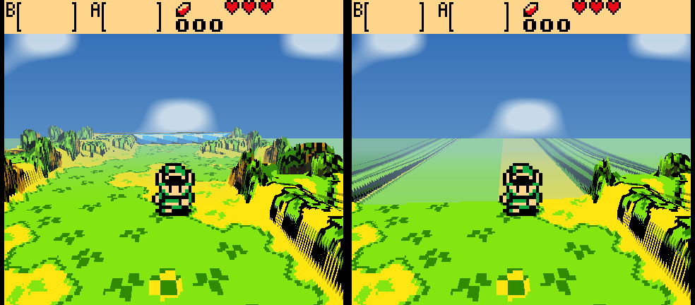
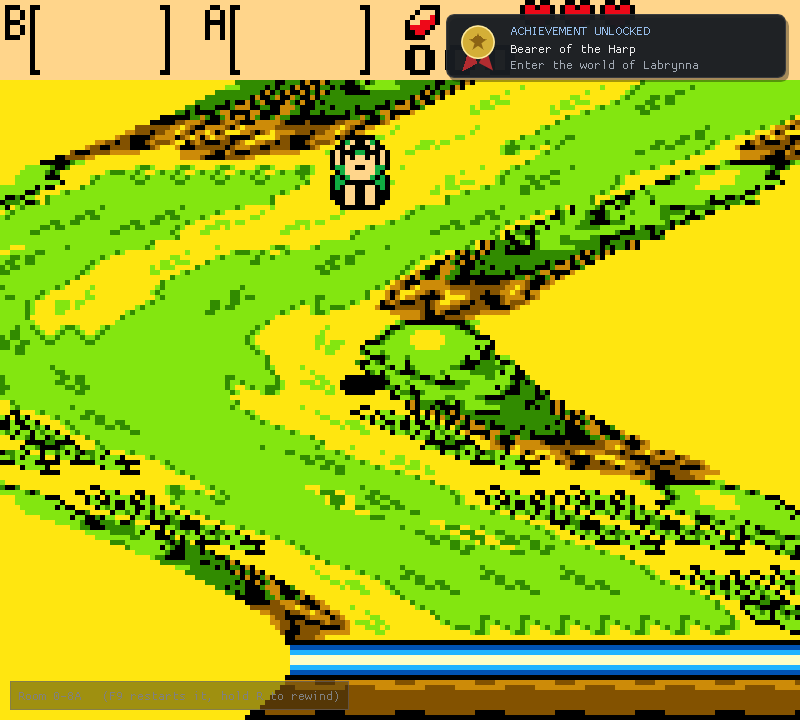
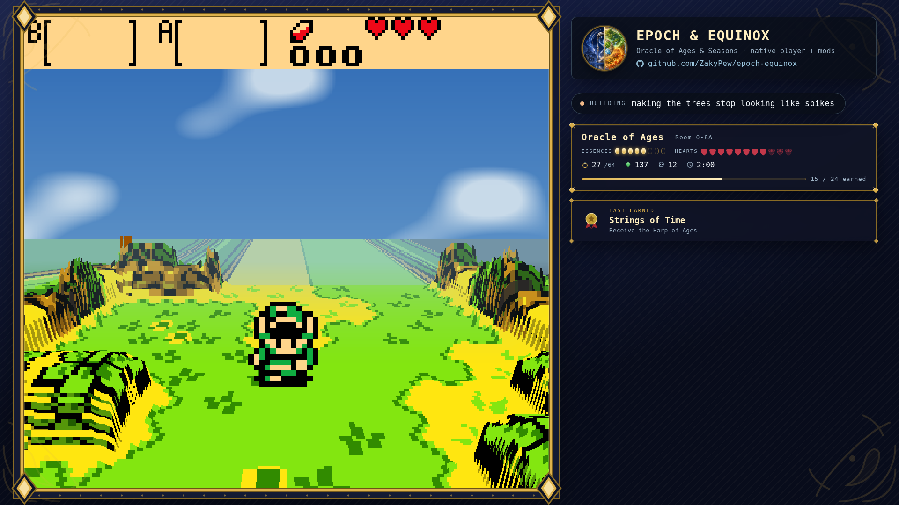

<h1 align="center">Epoch &amp; Equinox</h1>

<p align="center">
  A native player for <b>The Legend of Zelda: Oracle of Ages</b> and
  <b>Oracle of Seasons</b> — modern launcher, mod support, and an optional
  3D voxel mode with a third-person chase camera. Bring your own ROMs.
</p>

<p align="center">
  
</p>

<p align="center">
  
  
  
</p>

---

> [!IMPORTANT]
> **This project contains no game code, and neither do its binaries.** The
> player reads a ROM you supply at runtime, like any emulator — nothing
> derived from the games ships in this repository or in a release.

Both games run from one binary at full native speed, with savestates, shader
presets, controller remapping, SGB borders, IPS/BPS mod loading — and a voxel
mode that rebuilds the overworld out of the Game Boy's own tilemap: tilted
dioramas at 3× internal resolution, hand-sculptable room heights, and a
third-person chase camera that follows Link through the world in perspective.

<p align="center">
  
  <br>
  <em>The same room, untouched · as a diorama · from the chase camera</em>
</p>

<p align="center">
  
</p>

## What's inside

| | |
|---|---|
| **Player** | Both carts native from one binary; savestates, rewind (~12 s), shader presets, SGB borders, controller remapping, 40 ms audio |
| **Voxel mode** | Tilted dioramas and a third-person chase camera built from the game's own collision data, at 3× internal resolution — dungeons included, with distance fog and live-tunable look (`voxel/tuning.ini`) |
| **Sculpting** | Press F4 and paint room heights in-game (Backspace undoes); the same plain text files hand editors use |
| **Launcher** | Cover art, ROM install, IPS/BPS mods, controller navigation, self-update that never touches your saves |
| **Achievements** | Data-driven packs watched over the game's memory, Steam-style toasts, custom icons, a browser in launcher and Esc menu |
| **Secrets** | Every code your save can produce, generated with the game's own cipher — and the panel can type them into the grid for you |
| **Continue Legend** | Finish one game, click once: the other game starts, enters your transfer secret by itself, and hands you the linked quest to the true ending |
| **Saves** | Import from any emulator (validated by content), export, and a backup trail where every replacement is one click to undo — each slot's essences, hearts, rings, deaths and playtime at a glance |
| **Streaming** | OBS overlays fed live by the player: framed layouts with a real hole for the game, achievement cards, and a Stream page in the launcher to configure it all |
| **Speedrunning** | Auto-splits that drive LiveSplit, run timer, split list, input display, and an item tracker that can wear icons ripped from your own ROM |

## Quick start

**Easiest: grab a build from [Releases](../../releases)** (or the latest
`build` artifact under Actions), unzip it, and drop your ROMs into the
`roms/` folder next to the binary:

| game | file | SHA-1 |
|---|---|---|
| Oracle of Ages (USA/Australia) | `roms/tlozooa.gbc` | `880374fb978b18af4aa529e2e32f7ffb4d7dd2f4` |
| Oracle of Seasons (USA/Australia) | `roms/tlozoos.gbc` | `ba1268290fb2b1b70505d2d7b5825fc8a4816a4b` |

Then run `epoch` (double-click works). Either game alone is fine — you'll
just get that one, and any other Game Boy / Game Boy Color ROM in `roms/`
shows up too. The Oracles hashes are verified at launch; a different
revision gets a warning.

**Staying current.** The launcher checks GitHub for a newer release on
startup and notes one in the corner if it finds it; **Updates** in the menu
checks on demand, shows the release notes, and installs the new build in
place. It replaces what the release ships and nothing else — your `roms/`,
`mods/`, `covers/` and save files are left exactly as they are. Being
offline is not an error: the startup check gives up quietly. A launcher run
from a source checkout won't overwrite itself; use `git pull`.

**Building from source** takes about a minute — no game data is involved:

```sh
git clone https://github.com/ZakyPew/epoch-equinox.git
cd epoch-equinox
./setup.sh          # Linux/macOS; Windows: setup.ps1 (needs VS + vcpkg)
```

<details>
<summary><b>History: why this repo used to take 25 minutes to build</b></summary>

Earlier revisions statically recompiled each ROM into ~170 MB of generated C
and linked it into the binary — which is also why binaries could never be
distributed. Then [`tools/interp_probe.c`](tools/interp_probe.c) demonstrated
the generated code was never executed: the runtime's dispatch interprets
straight from the loaded ROM image, and a cart-free binary produces
byte-identical frames. The generation step is gone; what remains is a player
that happens to have unusually good knowledge of two specific games.

</details>

## Controls

Defaults. All of it is rebindable in the in-game menu, which also has per-brand
button labels for Xbox, PlayStation, Switch Pro and Joy-Con.

| Action | Keyboard | Controller |
|---|---|---|
| D-pad | Arrow keys / `WASD` | D-pad or left stick |
| A | `Z` / `J` | B *(right face button)* |
| B | `X` / `K` | A *(bottom face button)* |
| Select | `Backspace` / `Right Shift` | Back |
| Start | `Enter` | Start |
| Fast forward *(hold)* | `Tab` | Right trigger |
| Max speed *(toggle)* | `` ` `` | Left trigger |

> Face buttons follow the Nintendo layout, so on an Xbox pad the Game Boy's A
> is the physically right button and B is the bottom one — the same positions
> as the original hardware.

## Hotkeys

| Key | Action | Controller |
|---|---|---|
| `Esc` / `F10` | Open the runtime menu | L3 / R3 |
| `F5` | Save state | X |
| `F8` | Load state | Y |
| `F6` / `F7` | Previous / next savestate slot | — |
| `F1` | Toggle FPS overlay | — |
| `M` | Mute | — |
| **`F2`** | **Achievements & Secrets panel** | — |
| **`F3`** | **Cycle voxel mode** (off → 15° → 30° → 45° → chase cam) | — |
| **`F4`** | **Sculpt room heights** (voxel modes; number keys paint, `Bksp` undoes) | — |
| **`R`** *(hold)* | **Rewind** — step back through the last ~12 seconds | — |
| **`F9`** | Jump back to the moment you entered this room | — |
| **`C`** | Chase cam: swing behind Link (hold to keep following) | **R3** |

The Esc menu opens with a **Display** section — fullscreen, scaling mode
(Pixel Perfect / Aspect Fit / Aspect Fill / Stretch), scale filter, window
size, and a live readout of the exact scale on screen (e.g. `Showing 9x:
1440x1296 in a 2560x1400 window`). Pixel Perfect grows in whole steps and
letterboxes the rest — that is what keeps it razor sharp; use Aspect Fit to
fill the window instead. Below it: the voxel diorama section, then the rest
(savestates, palettes, shader presets, SGB borders, hardware mode, audio and
input remapping).

### Rewind and room checkpoints

Old games are unforgiving in ways that stopped being fun; these give the time
back without touching the game.

**Hold `R`** and play runs backwards through the last twelve seconds or so —
let go and it continues from wherever you stopped. A bad jump, a cheap hit, a
puzzle you'd rather retry costs a second instead of a walk.

**`F9`** returns you to the moment you walked into the room you're standing in.
The player watches the game's own `wActiveRoom` and drops a checkpoint on every
room change, which is LynnaLab's "quickstart" idea from the other side of the
screen — the editor boots you into a room, this puts you back at the start of
one.

A corner readout shows the room you're in (`Room 0-6A`) while you play, which is
also the number you need to name its
[height-override file](#sculpting-rooms-by-hand).

## Launch options

The launcher handles this for you, but the binary stands alone:

| option | effect |
|---|---|
| `--game <id>` | run a cart directly (`tlozooa`, `tlozoos`) |
| `--list-games` | print the ids in this build |
| `--no-mods` | boot the stock ROM, ignoring `mods/` |
| `--voxel <n>` | start with the voxel mode on (`0`–`4`; `4` = chase cam) |
| `--games-json` | machine-readable game table (what the launcher reads) |

```sh
./build/epoch --game tlozooa --voxel 2
```

## Voxel mode

**Off by default — press `F3`.** The game plays exactly as it always did until
you turn it on.

The overworld is re-rendered as a tilted 3D diorama, rebuilt every frame from
PPU state, plus the game's own collision and camera data read live from WRAM
at the addresses named by
[oracles-disasm](https://github.com/Stewmath/oracles-disasm).

- **on the Oracles carts, terrain shape comes from the game's own collision
  data** — `wRoomCollisions` and the camera, read live from WRAM at the
  addresses named by [oracles-disasm](https://github.com/Stewmath/oracles-disasm).
  Values `$01`-`$0F` are decoded as the game's real four-bit 8×8-quadrant
  mask, so a half wall occupies only its solid half instead of becoming a
  mysteriously shorter 16×16 block. Water sinks because the game says it's
  water; walls rise because collision says solid; menus render flat because
  `wOpenedMenuType` says a menu is open
- on anything else, tiles are classified per 8×8 by colour — water sinks,
  paths lie flat, bushes and rocks rise, trees and walls rise highest
- the world is marched far-to-near, projecting cell tops and filling the
  exposed front wall where height steps down. In chase view, authoritative
  height edges also receive true planar faces. Their full 8px bands come from
  the original raised tiles with nearest-neighbour sampling -- no invented
  masonry and no stretched scanlines -- so cliffs keep both their cart artwork
  and their straight room-layout corners
- walkable ground enclosed by those cliff lips becomes a raised plateau. Its
  base inherits the bordering lip's actual mid/high class, so Link and props
  stand on a shelf exactly level with the edge instead of above it or behind a
  fence on flat ground
- motion is eased: terrain grows in after a room change instead of
  popping, and Link's ground height ramps across cell boundaries
- terrain is textured from the game's *own* BG tilemap — palettes, season
  tints and tile animation carry through untouched, and because sprites are
  not part of the tilemap, nobody leaves a flattened ghost of themselves in
  the ground
- sprites are re-decoded from VRAM and stood upright as billboards. Trees and
  cuttable shrubs are different: `wRoomLayout` identifies each object while
  the original 16x16 BG pixels become fixed geometry. A full tree keeps that
  complete drawing on a hard canopy tile above a separate trunk tile sampled
  from its lower centre. Exposed canopy sides unfold the corresponding half
  of the same source art; connected forest variants still meet exactly as the
  cart drew them, with no rounded shell or camera-facing tree billboard.
  Tufts recover their silhouette and become shallow pixel reliefs. The
  overhead copy is removed from the ground, and the depth buffer lets these
  world objects hide Link correctly
- water ripples; room-to-room walks keep the sky up and slide the rooms
  through flat rather than flickering guessed terrain
- **the sky follows the game**: season-tinted in Seasons (spring through
  winter, ember-red in Subrosia), day blue in Ages' present, golden dusk in
  the past — with slow procedural clouds. Interiors keep a neutral backdrop
- the status bar stays flat and composites back on top
- **chase cam** (`F3` to the last stop): a third-person camera that starts
  directly behind Link, raycasting the same heightfield in true perspective —
  distance fog and depth-scaled sprite billboards. It trails behind him while
  he walks, but **the right stick owns it**: the stick (or `Q`/`E`) orbits and
  briefly holds the chosen heading without fighting you. Click the right stick
  (or press `C`) to recenter immediately behind him; the Esc menu can disable
  automatic trailing entirely
- **a cliff has exact footprint and one shared height**: the collision nibble
  gives the occupied top-left, top-right, bottom-left and bottom-right
  quadrants exactly. The cartridge does not store a world-space Z coordinate;
  its art only implies whether a solid is a low ledge or a tall wall. Each
  connected solid mass therefore makes that visual choice once, rather than
  letting every shaded 8px tile create a different level. Chase view projects
  one planar face per exposed quarter-cell edge and textures it from the
  original tile bands, preserving ledges, inside corners and right-angle room
  geometry. Enclosed walkable regions inherit their cliff lip's height class,
  while tree lines are ignored as elevation boundaries. Known objects from `wRoomLayout`
  (such as trees) take their own semantic height, and unusual rooms can still
  set an explicit class in a height override. "One height per cliff" in the
  Esc menu turns the mass vote
  off
- **the world persists**: every room you visit is remembered, and the chase
  camera draws remembered neighbours past the room border — terrain, cliff
  faces, tree masses — so the world runs to the horizon and fills in as
  you explore instead of ending at the edge of the screen

<p align="center">
  
  <br>
  <em>Walking back the way he came: the room he already crossed is still
  there (left) where it used to end in fog (right)</em>
</p>

Output is a normal 160×144 frame handed back through the runtime's present
path, so shaders, scaling and screenshots all still apply.

### Tuning the look live

The override files decide *which* height class a cell is; the Esc menu's
**Voxel Diorama** section decides what a height class **looks like** — and
the sliders reshape the world under the menu as you drag them:

| | |
|---|---|
| **Shape** | height of grass, bushes and trees; water depth; foliage footprint; tilt height |
| **Chase camera** | distance, height, field of view, vertical scale, fog start and strength |
| **Diorama finish** | pixel cubes (every pixel a tiny lit block) and tilt-shift blur (a diorama-photo focus band); either slider to zero turns it off |

`chase_follow` in `voxel/tuning.ini` is how fast the camera swings behind
Link, per frame: `0.05` ships, higher snaps harder, and `0` pins the camera
to a fixed heading the way earlier builds did.

*Foliage footprint* is how far a tree pulls back from its cell edge — `0`
gives hard blocks, high values give tufts standing in the grass.

**Save tuning** writes `voxel/tuning.ini` next to the binary: a plain text
file you can share, commit, or delete to go back to the defaults. Finding a
better look is a slider and a save, not a rebuild.

### Sculpting rooms by hand

Collision decides what rises — which is right until a room decorates itself
with props you can walk past (statue rows, gates, cave mouths): solid to the
eye, `$00` to the collision map, flat in the diorama. Plain text files get
the final word, per room:

```
voxel/overrides/ages-0-6a.txt     # game, group, room (hex), next to the binary
```

8 rows × 10 characters, one per 16×16 room cell: `.` keep, `_` flat,
`w` water, `l` low, `m` mid, `h` high. Comments with `#`.

**You can sculpt from inside the game.** Toggle *Sculpt room heights* in
the Esc menu's voxel section (or press **F4** in a voxel mode): the cell in
front of Link glows gold, and the number keys paint it — `1` flat, `2`
water, `3` low, `4` mid, `5` high, `0` back to whatever collision says.
**Backspace** undoes your paints in the room you are standing in, newest
first — paints made in other rooms wait on the stack until you walk back.
Every press rewrites the room's override file for you, atomically, so what
you sculpt is exactly what the file format above describes — hand edits and
in-game edits are the same thing, and cells you authored by hand survive
in-game painting (undo puts back exactly what each paint replaced,
including hand-authored values).

Prefer a text editor? **Editing is live either way.** The file is polled a
few times a second while you stand in the room, so saving reshapes the
terrain in front of you — no restart, no leaving the room. `VOXEL_EDIT=1`
still writes a ready-to-edit template for any room without a file (with the
collision-derived heights as a comment), and now also starts the player
with sculpt mode armed.

Colour-only vs the game's own collision data, same frame:

<p align="center"></p>

<details>
<summary><b>Honest limits</b></summary>

- On non-Oracles carts, heights come from what tiles *look like* — a plausible
  relief rather than a correct one. Thresholds are tunable at the top of
  [`voxel_tiles.c`](src/voxel/voxel_tiles.c).
- During room-to-room scroll transitions the collision grid describes the
  *next* room while the screen still shows both, so those half-seconds render
  as a flat slide — calm, but flat. `VOXEL_NO_ORACLE=1` forces the colour
  classifier everywhere, for A/B tests.
- The trusted-frame gate accepts exactly `wScrollMode == 1`. If some corner
  of the game uses another value during normal play (candidates: large
  scrolling dungeon rooms), those rooms fall back to the flat slide too —
  wrong-but-calm, never wrong-and-extruded.
- Fixed pitch ladder. No free-roam or first-person camera — moving the player
  off the grid would mean fighting the game's own movement code.
- The diorama renders at 3× internal resolution (`VOXEL_SCALE=1`–`4` to
  change): texels stay chunky — that's the pixel art — but silhouettes,
  domes and the camera tilt resolve at sub-GB precision instead of a
  160×144 staircase. Flat (non-voxel) play is still native 160×144.
- On the Oracles carts, menus and boot cinematics now render flat
  automatically. Interiors extrude by their real collision, which reads well.
  On other carts the classifier only sees tiles, so menus extrude — `F3` off.
- **No widescreen, and that's measured not guessed.** `VOXEL_DUMP_MAP=<frame>`
  writes the whole 32×32 BG map; mid-gameplay it holds about one screen of real
  tiles and flat filler everywhere else. Oracles only maintains the columns
  it's about to scroll into, so there's no off-screen world to reveal.
- **60 FPS is already the case.** The runtime paces at the Game Boy's native
  59.7 FPS and Oracles runs its logic every frame — there's no 20/30→60 unlock
  to do like on N64 recomps.

`VOXEL_DEBUG=1` prints per-frame classification stats.

</details>

## Achievements



The player watches the game's own memory and pops a toast over the window
— Steam-style, top right — when you earn something. The game is never
touched: no patched ROM, no injected sprites, just the host reading WRAM
and drawing over the presented frame.

The shipped packs cover essences, sword and heart upgrades, rings, kill
counts and a few signature treasures per cart, with every address taken
from the [oracles disassembly](https://github.com/Stewmath/oracles-disasm).
Unlocks live in `states/achievements-<cart>.txt` — plain text, one id per
line, delete a line to earn it again.

Packs are just data: `achievements/<cart>.txt` ships with the player, and
any `achievements/<cart>.<yourname>.txt` beside it loads too, so a mod or
a player can add achievements without code. The format (six condition
kinds over WRAM addresses) is documented in
[achievements/README.md](achievements/README.md), and
`EPOCH_TOAST_TEST=1` pops a sample toast at boot so you can see the card
without earning anything.

Browse them in two places: **Achievements** in the launcher menu, and the
in-game panel on **F2** — earned entries lit, the rest dimmed, with the
tally up top. (The panel is ours; the emulator's Esc menu stays for
display and emulator settings.) Each achievement can carry its own 48×48
icon (`achievements/icons/<cart>/<id>.pam`, with real per-pixel alpha); the
gilded card and the lists use it, and anything without art gets the
built-in medal. The wanted list and exact spec live in
[achievements/icons/README.md](achievements/icons/README.md).

Nothing can unlock outside actual play: evaluation is gated on both
`wLinkMaxHealth` and `wScrollMode`, so the title screen and the file
select — which loads a file's data into WRAM just to draw its preview
card — stay inert.

## Secrets

Oracle secrets are not universal passwords: every save carries a random
Game ID, and every code is encoded against it with a cipher and a
checksum, so a code from a website will not validate on your file.
**Secrets** in the launcher menu generates yours — from your own save,
using the game's own algorithm (ported from the
[disassembly](https://github.com/Stewmath/oracles-disasm)'s bank 3):

- the **game secret** that starts your linked game in the other cart
  (or the hero's secret, if this file is already linked),
- the **ring secret** that carries your ring collection across,
- and all twenty **NPC memory secrets** with their return codes —
  labelled by who to tell, so the tedious half of linking is a
  read-off instead of a scavenger hunt.

Codes are spelled in the games' symbol alphabet (♠ ♥ ● ▲ → …), grouped
in fives the way the entry grid expects.

**Or let it type them.** Open the game's own secret screen, press F2 for
the panel, pick a secret on the Secrets tab, and the cursor walks the
grid and enters it — twenty symbols without touching the d-pad. It steers
by reading the game's own cursor position each frame rather than writing
into its memory, so if the game disagrees, the game wins. A file that has never used a
secret has no Game ID yet; its codes are accepted by any file, which is
the game's own behaviour, and the dialog says so when it applies.

## Continue the Legend

The Oracles are halves of one story: finish either game and Farore
speaks a twenty-symbol secret; enter it in the other cart and the
**linked quest** begins — the only road to the true ending. This player
closes that seam. **Continue Legend** in the launcher menu (on the game
you finished) starts the other game, and the player enters the secret
*itself*: it walks the file select to SECRETS on a free file, drives the
game's own cursor around the symbol grid — the same typist as the Esc
menu, reading where the cursor is from the game's memory and never
writing into it — accepts, and stops only when your linked game is
standing in a room. The whole drive runs at max speed — splash screens,
title, file select all fast-forward — and normal speed returns the
instant the machine finishes.

Touch nothing while it types: any real button press cancels the machine
and hands the game to you. Full slots or a missing ROM are told to you
up front. The whole handoff is one plain file (`states/handoff.txt`)
the player consumes on success.

## Saves

Your progress is a plain battery save — the same `.sav` any Game Boy
emulator writes — kept beside the binary under the cartridge's own name.
**Saves** in the launcher menu manages it:

- **Import** a save from anywhere: another emulator, another machine, a
  downloaded 100% file. It is checked before it lands — a Seasons save
  on the Ages page is refused by content, not by filename — and works
  even before your first in-game save, since the file's name is derived
  from the ROM the same way the player derives it.
- **Export a copy** to take your file somewhere else.
- **Back up now**, and browse the backup trail with one-click
  **Restore**.

Nothing on that page can lose a file: anything that replaces the save —
an import, a restore — backs the old one up first into `save-backups/`,
which self-updates leave untouched. The dialog also shows what is inside
the save — each file slot's hero, linked/hero status, Game ID, and the
run at a glance: essences, hearts, rings, deaths, playtime — read with
the same parser the secret generator trusts, at the same addresses the
live stream feed reads.

## Mods

Mods are applied to the extracted ROM *before* the cart boots, which is why the
toggles live in the launcher. A pristine snapshot is kept and the live ROM
rebuilt from it every launch, so turning a mod off genuinely undoes it and two
runs with the same mod set are byte-identical.

One directory per mod under `mods/`:

```
mods/my-randomizer/
  manifest.json      required
  seed.bps           patch named by the manifest
  overlay/           optional raw byte splices
  voxel/tree.ppm     optional 16x16 source-art override for trees (chase cam)
  voxel/tuft.ppm     ... and for bushes and grass tufts
```

The `voxel/` images are plain 16×16 P6 PPMs (`magick art.png art.ppm`). By
default, recognized tree and tuft cells become voxel volumes whose colours and
pixel detail come from the cart's live tile art, including season and tileset
changes. Supplying `voxel/tree.ppm` or `voxel/tuft.ppm` replaces that source
art but keeps the same world-space geometry—never a camera-facing billboard.
When several enabled mods supply the same file, the highest-priority mod wins
— the same order the ROM patches apply in.

```json
{
  "id":       "my-randomizer",
  "name":     "Seasons Randomizer",
  "version":  "1.0.0",
  "games":    ["tlozoos"],
  "patch":    "seed.bps",
  "priority": 100,
  "enabled":  true
}
```

**IPS and BPS both work** — that's what Oracles randomizers and romhacks
already ship as, so most existing patches drop straight in. Unknown manifest
keys are ignored, so a manifest written for a newer loader still loads.

Worked example and the full field reference: [`examples/mods/`](examples/mods).

> [!NOTE]
> A patch that changes the ROM's **size** can't work here — the generated C is
> bound to the original bank layout, so the loader reports it and skips the mod
> rather than booting something broken. BPS patches also carry a source
> checksum; one built for a different revision is rejected with a message
> instead of silently producing garbage.

## Cover art

Each launcher panel draws a procedural motif unless you supply art.

| where | for | committed? |
|---|---|---|
| `build/covers/<id>.png` | your own art, this machine only | no |
| `art/covers/<id>.png` | art shipped with the project | yes |

```sh
python3 tools/install_cover_art.py --ages ages.png --seasons seasons.png
```

That names, centre-crops and resizes both correctly. **1600 × 1600 square** is
ideal; keep the subject in the middle 70%, since the diagonal seam cuts the
inner edge and the title sits over the outer one. Add `--local` for art that
shouldn't be redistributed. Details: [`art/covers/README.md`](art/covers/README.md).

## Building by hand

```sh
sudo apt-get install -y build-essential cmake ninja-build \
    libsdl2-dev libcurl4-openssl-dev     # Debian/Ubuntu
# brew install cmake ninja sdl2 curl    # macOS

cmake -S . -B build -G Ninja
cmake --build build -j$(nproc)          # ~1 minute

pip install -r launcher/requirements.txt
python3 launcher/epoch_launcher.py      # or just ./build/epoch
```

| CMake option | default | effect |
|---|---|---|
| `EPOCH_WITH_VOXEL` | `ON` | build the voxel renderer |
| `GBRT_REF` | `main` | pin a git ref for the fetched runtime |

Windows source builds need Visual Studio's C++ workload plus
[vcpkg](https://github.com/microsoft/vcpkg) for SDL2/libcurl — `setup.ps1`
walks through it. Or skip all of that and take the release binary.

<details>
<summary><b>Troubleshooting</b></summary>

**"No playable game"** — the binary looks for `roms/` next to itself. Put
your ROMs there (see [Quick start](#quick-start)).

**pip refuses: "externally managed environment"** — use a virtualenv:

```sh
python3 -m venv .venv && . .venv/bin/activate
pip install -r launcher/requirements.txt
python launcher/epoch_launcher.py
```

**SHA-256 warning at launch** — your dump isn't the USA/Australia revision.
It will still run; the warning just means the hashes don't match the
revision this project is tuned against.

**No controller in the launcher** — `pip install pygame`. Optional; the game
itself handles pads either way.

**Windows: "cannot be loaded because running scripts is disabled"** — use
`powershell -ExecutionPolicy Bypass -File setup.ps1` verbatim; it applies to
that one run only.

</details>

## Streaming

Four transparent OBS overlays, landscape and vertical, each in two styles:
`overlay.html` / `overlay-vertical.html` float a few panels over your capture,
and `overlay-framed.html` / `overlay-framed-vertical.html` dress the whole
canvas — a navy mat, a gilded frame around the play area with a real hole cut
for the game, and a rail of live stats beside it (with an optional camera
opening). The vertical pair stay clear of the UI mobile platforms draw over
the frame.



While the player is running it writes `stream/live.js` once a second, and the
overlays show the game, the room, essences, hearts, rings, rupees, deaths,
play time and achievements earned — with an unlock card that lands the moment
one is. Nothing is shown until you are actually in a room with a file loaded.
The launcher's **Stream** page does the setup for you: pick a layout, copy
the exact numbers to give OBS, move either opening (with a Snap button that
rounds to a whole multiple of 160×144), toggle the camera hole and the
alignment guide, and type the "now building" line. Everything it writes is
a plain file you can still edit by hand — see
[stream/README.md](stream/README.md).

**Speedrunning:** the Stream page can also switch on a run timer (the
file's own clock, to hundredths), a split list driven by auto-splits the
player watches in the game's memory (`splits/`, and they push
`startorsplit` to LiveSplit's TCP server if you tick that on), an item
tracker, and an input display. See the
[v0.6.0 notes](docs/release-notes-v0.6.0.md) for the full tour.

**The tracker can wear the game's own item icons.** They rip from *your*
ROM, on your machine — the tool boots your cart headlessly, walks the
game's menus, equips each item and reads its icon out of the HUD's own
sprites, transparent background and all:

```sh
python3 tools/rip_item_icons.py
```

Icons land in `stream/icons/items/` (gitignored — cartridge art never
leaves your machine), and any cell without one keeps its text label.
Everything that can sit on a button gets ripped; passive treasures
(flippers, the mermaid suit, rings) stay text.

## Roadmap

What's next, what it costs, and what blocks what: **[ROADMAP.md](ROADMAP.md)**.

## Contributing — we'd love more hands

The surface area is now bigger than one keyboard. The build is ~1 minute
from a cold clone (`setup.sh` / `setup.ps1`), CI covers Linux + Windows +
the patch chain, and every runtime modification is a reviewable patch file
in `patches/`. `src/` and `launcher/` are the project's own code.

If you are joining specifically to improve the 3D mode, start with the
**[CONTRIBUTING.md](CONTRIBUTING.md)** and the **[voxel contributor starter tasks](docs/CONTRIBUTOR_STARTER_TASKS.md)**. They point to focused work that can be reviewed independently. The **[voxel contributor guide](docs/VOXEL_CONTRIBUTING.md)** maps the render pipeline, gives the fast screenshot/test loop, and explains how to distinguish terrain, background objects and OAM sprites before writing geometry.

If any of this sounds fun, open an issue or just send a PR:

- **Renderer** (`src/voxel/`): dynamic prop reconstruction (the opening-scene
  chest is the first target), dungeon/large-room mapping, more compound
  structures, and eventually first-person mode. Plain C, one pass, no GPU
  code — the GLES side is already handled.
- **Room sculpting** (no code!): press F4 in a voxel mode and paint room
  heights with the number keys — the player writes the override files for
  you. A curated override pack for the whole overworld would ship as a
  default.
- **Mod API** (`src/mod_loader.c`): IPS/BPS/overlays work today; the next
  step is a scripting surface over the games' named WRAM symbols
  (`oracles-disasm` names hundreds — the voxel mode already reads a dozen
  live).
- **Achievements**: the memory-watch machinery exists; it needs a
  condition format, a definitions file, and a toast.
- **Voice packs**: dialog open/close is already detected; a playback mixer
  and a dialogue-transcript logger would make fan dubs possible.
- **Testing** (`tools/vox_shot.c`): boots a ROM headless, drives it with
  an input script, dumps frame pairs — the whole voxel pipeline was built
  against it. More scripted routes (dungeons!) directly increase coverage.
  `VOX_SHOT_NOCACHE=1` renders the same frame as if no room had ever been
  visited, which turns "does the persistent world do anything here?" into a
  pixel diff, and `VOX_DUMP_WORLD=1` prints hit/miss past each border.

**Never attach a ROM or ROM-derived asset to an issue or PR.** Battery
saves (`.sav`) are your own play data and are welcome — `tests/saves/`
exists exactly for save files parked in interesting places.

## Credits

Built on [GB-Recomp/gb-recompiled](https://github.com/GB-Recomp/gb-recompiled)
(MIT) — the static recompiler and runtime that make all of this possible, and
itself a fork of [arcanite24/gb-recompiled](https://github.com/arcanite24/gb-recompiled).

Symbol names come from [Stewmath/oracles-disasm](https://github.com/Stewmath/oracles-disasm),
the community disassembly.

Full attribution, including what this project started from and what is original
to it, is in [CREDITS.md](CREDITS.md).

## Legal

No ROM data is included, distributed, or produced by CI. The Legend of Zelda:
Oracle of Ages and Oracle of Seasons are © Nintendo / Capcom. Supply your own
dumps of games you own.

This project's own code is [MIT](LICENSE). Game Boy and Game Boy Color are
trademarks of Nintendo. This project is not affiliated with, endorsed by, or
associated with Nintendo or Capcom.
