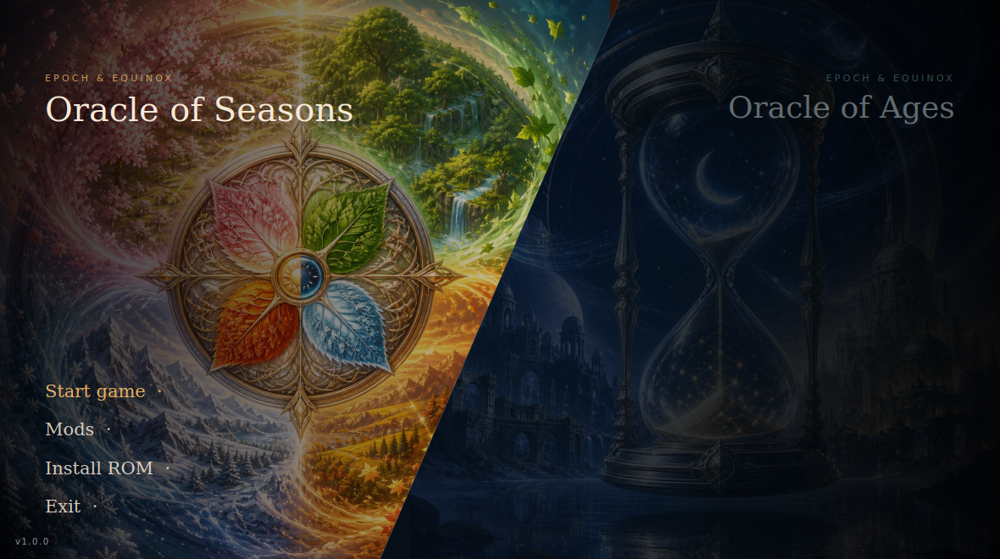
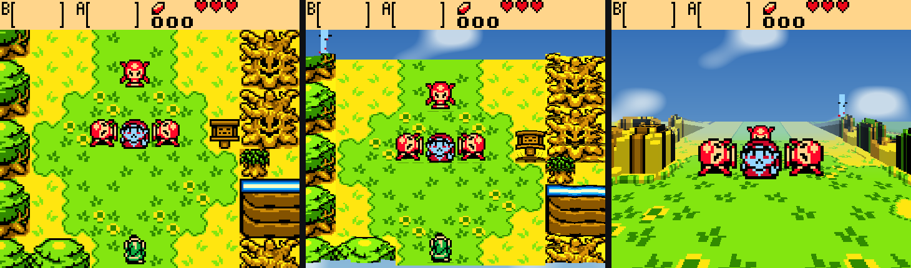
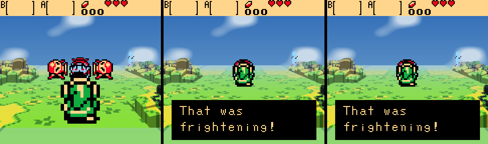
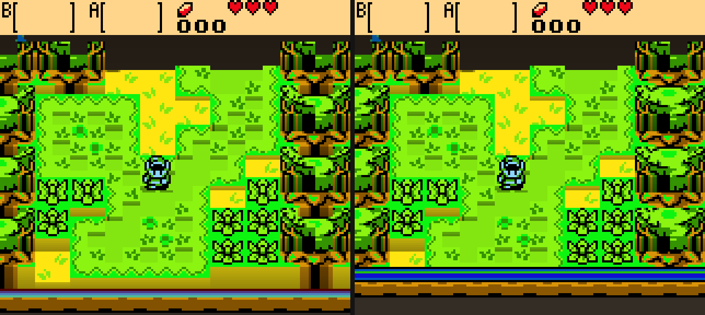

<h1 align="center">Epoch &amp; Equinox</h1>

<p align="center">
  A native player for <b>The Legend of Zelda: Oracle of Ages</b> and
  <b>Oracle of Seasons</b> — modern launcher, mod support, and an optional
  3D voxel mode with a third-person chase camera. Bring your own ROMs.
</p>

<p align="center">
  
</p>

<p align="center">
  
  
  
</p>

---

> [!IMPORTANT]
> **This project contains no game code, and neither do its binaries.** The
> player reads a ROM you supply at runtime, like any emulator — nothing
> derived from the games ships in this repository or in a release.

Both games run from one binary at full native speed, with savestates, shader
presets, controller remapping, SGB borders, IPS/BPS mod loading — and a voxel
mode that rebuilds the overworld out of the Game Boy's own tilemap: tilted
dioramas at 3× internal resolution, hand-sculptable room heights, and a
third-person chase camera that follows Link through the world in perspective.

<p align="center">
  
  <br>
  <em>The same room, untouched · as a diorama · from the chase camera</em>
</p>

<p align="center">
  
</p>

## Quick start

**Easiest: grab a build from [Releases](../../releases)** (or the latest
`build` artifact under Actions), unzip it, and drop your ROMs into the
`roms/` folder next to the binary:

| game | file | SHA-1 |
|---|---|---|
| Oracle of Ages (USA/Australia) | `roms/tlozooa.gbc` | `880374fb978b18af4aa529e2e32f7ffb4d7dd2f4` |
| Oracle of Seasons (USA/Australia) | `roms/tlozoos.gbc` | `ba1268290fb2b1b70505d2d7b5825fc8a4816a4b` |

Then run `epoch` (double-click works). Either game alone is fine — you'll
just get that one, and any other Game Boy / Game Boy Color ROM in `roms/`
shows up too. The Oracles hashes are verified at launch; a different
revision gets a warning.

**Building from source** takes about a minute — no game data is involved:

```sh
git clone https://github.com/ZakyPew/epoch-equinox.git
cd epoch-equinox
./setup.sh          # Linux/macOS; Windows: setup.ps1 (needs VS + vcpkg)
```

<details>
<summary><b>History: why this repo used to take 25 minutes to build</b></summary>

Earlier revisions statically recompiled each ROM into ~170 MB of generated C
and linked it into the binary — which is also why binaries could never be
distributed. Then [`tools/interp_probe.c`](tools/interp_probe.c) demonstrated
the generated code was never executed: the runtime's dispatch interprets
straight from the loaded ROM image, and a cart-free binary produces
byte-identical frames. The generation step is gone; what remains is a player
that happens to have unusually good knowledge of two specific games.

</details>

## Controls

Defaults. All of it is rebindable in the in-game menu, which also has per-brand
button labels for Xbox, PlayStation, Switch Pro and Joy-Con.

| Action | Keyboard | Controller |
|---|---|---|
| D-pad | Arrow keys / `WASD` | D-pad or left stick |
| A | `Z` / `J` | B *(right face button)* |
| B | `X` / `K` | A *(bottom face button)* |
| Select | `Backspace` / `Right Shift` | Back |
| Start | `Enter` | Start |
| Fast forward *(hold)* | `Tab` | Right trigger |
| Max speed *(toggle)* | `` ` `` | Left trigger |

> Face buttons follow the Nintendo layout, so on an Xbox pad the Game Boy's A
> is the physically right button and B is the bottom one — the same positions
> as the original hardware.

## Hotkeys

| Key | Action | Controller |
|---|---|---|
| `Esc` / `F10` | Open the runtime menu | L3 / R3 |
| `F5` | Save state | X |
| `F8` | Load state | Y |
| `F6` / `F7` | Previous / next savestate slot | — |
| `F1` | Toggle FPS overlay | — |
| `M` | Mute | — |
| **`F3`** | **Cycle voxel mode** (off → 15° → 30° → 45° → chase cam) | — |

The Esc menu opens with a **Display** section — fullscreen, scaling mode
(Pixel Perfect / Aspect Fit / Aspect Fill / Stretch), scale filter, window
size, and a live readout of the exact scale on screen (e.g. `Showing 9x:
1440x1296 in a 2560x1400 window`). Pixel Perfect grows in whole steps and
letterboxes the rest — that is what keeps it razor sharp; use Aspect Fit to
fill the window instead. Below it: the voxel diorama section, then the rest
(savestates, palettes, shader presets, SGB borders, hardware mode, audio and
input remapping).

## Launch options

The launcher handles this for you, but the binary stands alone:

| option | effect |
|---|---|
| `--game <id>` | run a cart directly (`tlozooa`, `tlozoos`) |
| `--list-games` | print the ids in this build |
| `--no-mods` | boot the stock ROM, ignoring `mods/` |
| `--voxel <n>` | start with the voxel mode on (`0`–`4`; `4` = chase cam) |
| `--games-json` | machine-readable game table (what the launcher reads) |

```sh
./build/epoch --game tlozooa --voxel 2
```

## Voxel mode

**Off by default — press `F3`.** The game plays exactly as it always did until
you turn it on.

The overworld is re-rendered as a tilted 3D diorama, rebuilt every frame from
PPU state, plus the game's own collision and camera data read live from WRAM
at the addresses named by
[oracles-disasm](https://github.com/Stewmath/oracles-disasm).

- **on the Oracles carts, terrain height comes from the game's own collision
  data** — `wRoomCollisions` and the camera, read live from WRAM at the
  addresses named by [oracles-disasm](https://github.com/Stewmath/oracles-disasm).
  Water sinks because the game says it's water; walls rise because collision
  says solid; menus render flat because `wOpenedMenuType` says a menu is open.
  Colours only break ties (tree vs fence, grass vs path)
- on anything else, tiles are classified per 8×8 by colour — water sinks,
  paths lie flat, bushes and rocks rise, trees and walls rise highest
- the world is marched far-to-near, projecting cell tops and filling the
  exposed front wall where height steps down. Walls are textured by tiling
  the cell's own art down the face; raised foliage gets a domed top so
  trees read as canopies while cliffs and fences stay architectural
- motion is eased: terrain grows in after a room change instead of
  popping, and Link's ground height ramps across cell boundaries
- terrain is textured from the game's *own* BG tilemap — palettes, season
  tints and tile animation carry through untouched, and because sprites are
  not part of the tilemap, nobody leaves a flattened ghost of themselves in
  the ground
- sprites are re-decoded from VRAM and stood upright as billboards, drawn in
  the same painter's order as the terrain — walk behind a tree and the tree
  actually hides you
- water ripples; room-to-room walks keep the sky up and slide the rooms
  through flat rather than flickering guessed terrain
- **the sky follows the game**: season-tinted in Seasons (spring through
  winter, ember-red in Subrosia), day blue in Ages' present, golden dusk in
  the past — with slow procedural clouds. Interiors keep a neutral backdrop
- the status bar stays flat and composites back on top
- **chase cam** (`F3` to the last stop): a third-person camera floating
  behind Link, looking where he faces, raycasting the same heightfield in
  true perspective — distance fog, depth-scaled sprite billboards, and a
  camera that sweeps around when he turns

Output is a normal 160×144 frame handed back through the runtime's present
path, so shaders, scaling and screenshots all still apply.

### Sculpting rooms by hand

Collision decides what rises — which is right until a room decorates itself
with props you can walk past (statue rows, gates, cave mouths): solid to the
eye, `$00` to the collision map, flat in the diorama. Plain text files get
the final word, per room:

```
voxel/overrides/ages-0-6a.txt     # game, group, room (hex), next to the binary
```

8 rows × 10 characters, one per 16×16 room cell: `.` keep, `_` flat,
`w` water, `l` low, `m` mid, `h` high. Comments with `#`.

Run with `VOXEL_EDIT=1` and every room you enter that has no override file
gets a ready-to-edit template written for it — including the
collision-derived heights as a comment, so you can see what you're
overriding. Edit the file, leave the room, walk back in: it reloads.

Colour-only vs the game's own collision data, same frame:

<p align="center"></p>

<details>
<summary><b>Honest limits</b></summary>

- On non-Oracles carts, heights come from what tiles *look like* — a plausible
  relief rather than a correct one. Thresholds are tunable at the top of
  [`voxel_tiles.c`](src/voxel/voxel_tiles.c).
- During room-to-room scroll transitions the collision grid describes the
  *next* room while the screen still shows both, so those half-seconds render
  as a flat slide — calm, but flat. `VOXEL_NO_ORACLE=1` forces the colour
  classifier everywhere, for A/B tests.
- The trusted-frame gate accepts exactly `wScrollMode == 1`. If some corner
  of the game uses another value during normal play (candidates: large
  scrolling dungeon rooms), those rooms fall back to the flat slide too —
  wrong-but-calm, never wrong-and-extruded.
- Fixed pitch ladder. No free-roam or first-person camera — moving the player
  off the grid would mean fighting the game's own movement code.
- The diorama renders at 3× internal resolution (`VOXEL_SCALE=1`–`4` to
  change): texels stay chunky — that's the pixel art — but silhouettes,
  domes and the camera tilt resolve at sub-GB precision instead of a
  160×144 staircase. Flat (non-voxel) play is still native 160×144.
- On the Oracles carts, menus and boot cinematics now render flat
  automatically. Interiors extrude by their real collision, which reads well.
  On other carts the classifier only sees tiles, so menus extrude — `F3` off.
- **No widescreen, and that's measured not guessed.** `VOXEL_DUMP_MAP=<frame>`
  writes the whole 32×32 BG map; mid-gameplay it holds about one screen of real
  tiles and flat filler everywhere else. Oracles only maintains the columns
  it's about to scroll into, so there's no off-screen world to reveal.
- **60 FPS is already the case.** The runtime paces at the Game Boy's native
  59.7 FPS and Oracles runs its logic every frame — there's no 20/30→60 unlock
  to do like on N64 recomps.

`VOXEL_DEBUG=1` prints per-frame classification stats.

</details>

## Mods

Mods are applied to the extracted ROM *before* the cart boots, which is why the
toggles live in the launcher. A pristine snapshot is kept and the live ROM
rebuilt from it every launch, so turning a mod off genuinely undoes it and two
runs with the same mod set are byte-identical.

One directory per mod under `mods/`:

```
mods/my-randomizer/
  manifest.json      required
  seed.bps           patch named by the manifest
  overlay/           optional raw byte splices
```

```json
{
  "id":       "my-randomizer",
  "name":     "Seasons Randomizer",
  "version":  "1.0.0",
  "games":    ["tlozoos"],
  "patch":    "seed.bps",
  "priority": 100,
  "enabled":  true
}
```

**IPS and BPS both work** — that's what Oracles randomizers and romhacks
already ship as, so most existing patches drop straight in. Unknown manifest
keys are ignored, so a manifest written for a newer loader still loads.

Worked example and the full field reference: [`examples/mods/`](examples/mods).

> [!NOTE]
> A patch that changes the ROM's **size** can't work here — the generated C is
> bound to the original bank layout, so the loader reports it and skips the mod
> rather than booting something broken. BPS patches also carry a source
> checksum; one built for a different revision is rejected with a message
> instead of silently producing garbage.

## Cover art

Each launcher panel draws a procedural motif unless you supply art.

| where | for | committed? |
|---|---|---|
| `build/covers/<id>.png` | your own art, this machine only | no |
| `art/covers/<id>.png` | art shipped with the project | yes |

```sh
python3 tools/install_cover_art.py --ages ages.png --seasons seasons.png
```

That names, centre-crops and resizes both correctly. **1600 × 1600 square** is
ideal; keep the subject in the middle 70%, since the diagonal seam cuts the
inner edge and the title sits over the outer one. Add `--local` for art that
shouldn't be redistributed. Details: [`art/covers/README.md`](art/covers/README.md).

## Building by hand

```sh
sudo apt-get install -y build-essential cmake ninja-build \
    libsdl2-dev libcurl4-openssl-dev     # Debian/Ubuntu
# brew install cmake ninja sdl2 curl    # macOS

cmake -S . -B build -G Ninja
cmake --build build -j$(nproc)          # ~1 minute

pip install -r launcher/requirements.txt
python3 launcher/epoch_launcher.py      # or just ./build/epoch
```

| CMake option | default | effect |
|---|---|---|
| `EPOCH_WITH_VOXEL` | `ON` | build the voxel renderer |
| `GBRT_REF` | `main` | pin a git ref for the fetched runtime |

Windows source builds need Visual Studio's C++ workload plus
[vcpkg](https://github.com/microsoft/vcpkg) for SDL2/libcurl — `setup.ps1`
walks through it. Or skip all of that and take the release binary.

<details>
<summary><b>Troubleshooting</b></summary>

**"No playable game"** — the binary looks for `roms/` next to itself. Put
your ROMs there (see [Quick start](#quick-start)).

**pip refuses: "externally managed environment"** — use a virtualenv:

```sh
python3 -m venv .venv && . .venv/bin/activate
pip install -r launcher/requirements.txt
python launcher/epoch_launcher.py
```

**SHA-256 warning at launch** — your dump isn't the USA/Australia revision.
It will still run; the warning just means the hashes don't match the
revision this project is tuned against.

**No controller in the launcher** — `pip install pygame`. Optional; the game
itself handles pads either way.

**Windows: "cannot be loaded because running scripts is disabled"** — use
`powershell -ExecutionPolicy Bypass -File setup.ps1` verbatim; it applies to
that one run only.

</details>

## Contributing — we'd love more hands

The surface area is now bigger than one keyboard. The build is ~1 minute
from a cold clone (`setup.sh` / `setup.ps1`), CI covers Linux + Windows +
the patch chain, and every runtime modification is a reviewable patch file
in `patches/`. `src/` and `launcher/` are the project's own code.

If any of this sounds fun, open an issue or just send a PR:

- **Renderer** (`src/voxel/`): sprite occlusion in chase cam, wall
  texturing in perspective, a room cache so the 3D world persists across
  screens, first-person mode. Plain C, one pass, no GPU code — the GLES
  side is already handled.
- **Room sculpting** (no code!): run with `VOXEL_EDIT=1` and every room
  you enter writes a ready-to-edit text template; heights are single
  characters. A curated override pack for the whole overworld would ship
  as a default.
- **Mod API** (`src/mod_loader.c`): IPS/BPS/overlays work today; the next
  step is a scripting surface over the games' named WRAM symbols
  (`oracles-disasm` names hundreds — the voxel mode already reads a dozen
  live).
- **Achievements**: the memory-watch machinery exists; it needs a
  condition format, a definitions file, and a toast.
- **Voice packs**: dialog open/close is already detected; a playback mixer
  and a dialogue-transcript logger would make fan dubs possible.
- **Testing** (`tools/vox_shot.c`): boots a ROM headless, drives it with
  an input script, dumps frame pairs — the whole voxel pipeline was built
  against it. More scripted routes (dungeons!) directly increase coverage.

**Never attach a ROM or ROM-derived asset to an issue or PR.** Battery
saves (`.sav`) are your own play data and are welcome — `tests/saves/`
exists exactly for save files parked in interesting places.

## Credits

Built on [GB-Recomp/gb-recompiled](https://github.com/GB-Recomp/gb-recompiled)
(MIT) — the static recompiler and runtime that make all of this possible, and
itself a fork of [arcanite24/gb-recompiled](https://github.com/arcanite24/gb-recompiled).

Symbol names come from [Stewmath/oracles-disasm](https://github.com/Stewmath/oracles-disasm),
the community disassembly.

Full attribution, including what this project started from and what is original
to it, is in [CREDITS.md](CREDITS.md).

## Legal

No ROM data is included, distributed, or produced by CI. The Legend of Zelda:
Oracle of Ages and Oracle of Seasons are © Nintendo / Capcom. Supply your own
dumps of games you own.

This project's own code is [MIT](LICENSE). Game Boy and Game Boy Color are
trademarks of Nintendo. This project is not affiliated with, endorsed by, or
associated with Nintendo or Capcom.
