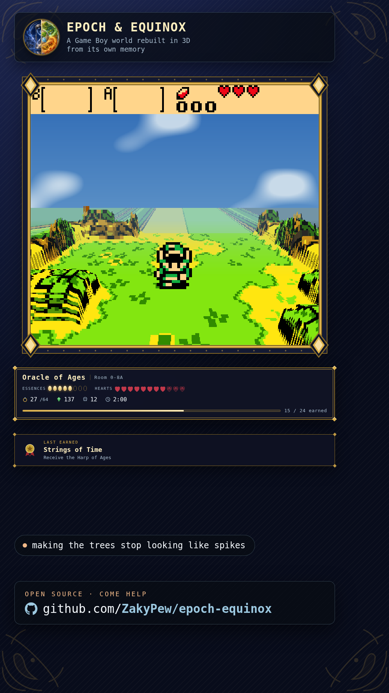
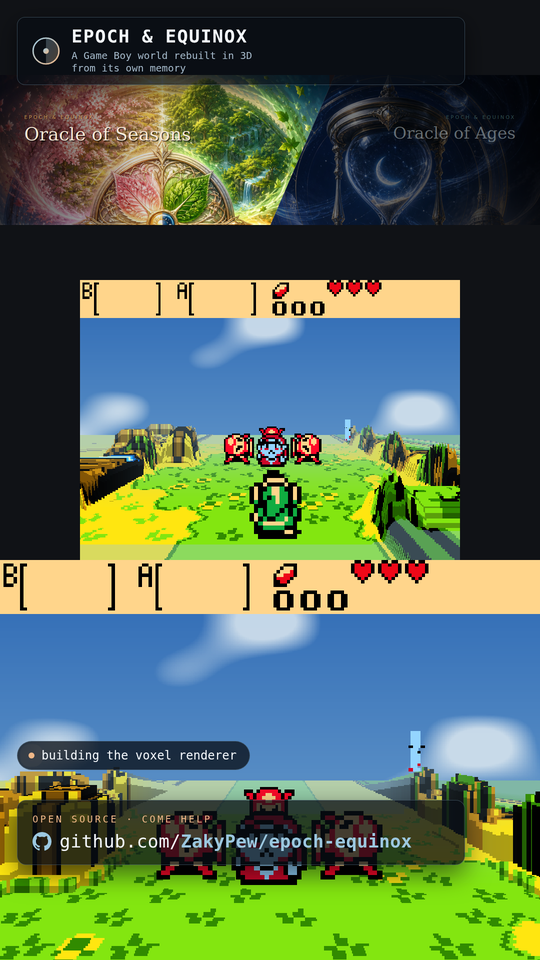
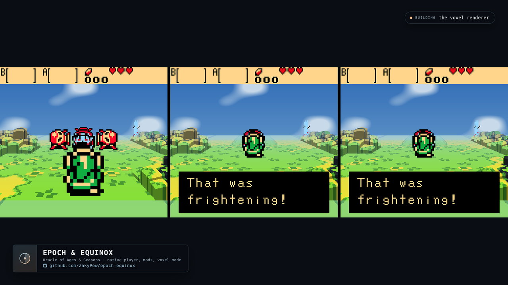

# Stream overlays

Four layouts, all transparent, all driven by the same two feeds:

| file | canvas | for |
|---|---|---|
| `overlay.html` | 1920×1080 | Twitch / YouTube landscape, floating over your capture |
| `overlay-vertical.html` | 1080×1920 | TikTok, Reels, Shorts, vertical Twitch |
| `overlay-framed.html` | 1920×1080 | a full-screen scene with the game in a gilded frame |
| `overlay-framed-vertical.html` | 1080×1920 | the same, vertical |

The first two float a few panels over whatever you are capturing. The
**framed** pair dress the whole canvas instead — a deep navy mat, a gilded
picture frame around the play area, and a rail of live stats beside it —
so the game sits in the scene like a painting rather than being covered up
by it.








## The launcher's Stream page

The launcher has a **Stream** item that does all of the below without a
text editor: pick a layout, see the exact numbers to give OBS (and copy
them), move either opening, turn the camera hole and the alignment guide
on or off, and edit the "now building" line. Nothing is written until you
press Apply, and an opening that would hang off the canvas is refused
rather than saved.

Everything it writes stays a plain file you can edit by hand — the page is
a convenience, not a new source of truth.

## Add it in OBS

1. **Sources → + → Browser**
2. Tick **Local file**, choose one of the four files above
3. Width **1920**, height **1080** — or **1080**×**1920** for the vertical ones
4. Leave "Shutdown source when not visible" **off** so the feeds keep polling

Get step 3 wrong and the page says so: an overlay in a source of the wrong
size does not scale, it gets cropped, so it prints the numbers to type
across the top rather than leaving you to work it out from a mangled
render.

The floating layouts are done at that point; the background is transparent,
so they composite over whatever is underneath.

### The framed layouts, one extra step

The opening in the frame is a real hole — the mat is four panels built
*around* it, not one panel with a dark rectangle painted in — so your game
capture shows through it. Put the game source **below** the browser source
and give it these numbers in **Edit → Transform**:

| layout | position | size |
|---|---|---|
| `overlay-framed.html` | 52, 36 | 1120 × 1008 |
| `overlay-framed-vertical.html` | 85, 236 | 800 × 720 |

Both are exact multiples of the Game Boy's 160×144 (7× and 5×), so flat
mode stays pixel-crisp with no resampling.

Rather than remember that, turn the **alignment guide** on — from the
launcher's Stream page, with **`?guide`** on the end of the file path, or
by pressing **G** with the source selected and interacting — and it prints
the rectangle over itself. Turn it off before you go live.

The guide reads its numbers back out of the layout, so moving an opening
can never leave a stale caption behind.

### A camera opening too

Tick **Camera opening** on the Stream page (or add **`?cam`**, or press
**C**) and a second, 16:9 hole opens in the rail with a matching frame.
Same idea: put the camera source below the browser source at

| layout | position | size |
|---|---|---|
| `overlay-framed.html` | 1220, 560 | 560 × 315 |
| `overlay-framed-vertical.html` | 40, 1190 | 640 × 360 |

Both can be combined: `overlay-framed.html?cam&guide`.

Without `?cam` that part of the canvas is simply empty mat, which is a
perfectly good place to float a round webcam of your own. On the vertical
layout the camera takes the lower band, so the repo link and the "now
building" pill step aside while it is on.

### Moving the frame

Every rectangle above is a CSS variable in the first twenty lines of the
file (`--box-x`, `--box-y`, `--box-w`, `--box-h`, and the `--cam-*` four).
Change them — by hand or from the Stream page — and the mat, the frame, the
studs and the guide caption all follow. Nothing else is hard-coded.

The **Snap** button rounds an opening to the nearest whole multiple of
160×144 that still fits, which is what keeps flat mode pixel-crisp.

## Live game state

When the player is running it writes `stream/live.js` beside itself once a
second, and the overlays pick it up:

- the game, the room, and a **linked game** badge
- essences, heart containers, rings, rupees, deaths and play time
- achievements earned out of the total, with a filling bar
- an **achievement unlocked** card that lands the instant one is earned,
  and (on the framed layouts) a standing *last earned* plaque between them
- the achievement's **own icon** on both, from `stream/icons/`

Nothing is shown until the player is actually in a room with a file
loaded — the file-select screen has a half-built save in memory and would
otherwise drive the panel with someone else's numbers. If the player exits,
the panel hides itself after twelve seconds rather than leave stale numbers
on screen looking live.

The release archives put `stream/` next to the binary, which is exactly
where the player writes `live.js`, so it works out of the box. If you run
the player from somewhere else, point OBS at the `stream/` folder in *that*
working directory.

## Change the "now building" line mid-stream

Type it on the launcher's Stream page, or edit `stream/now.js` and save —
either way every overlay picks it up within a few seconds. One line:

```js
NOW("chasing down the tree shapes");
```

If the file is missing the overlay keeps its default text, so nothing
breaks.

(Both feeds are `.js` files rather than JSON or plain text for an annoying
reason: OBS loads a local overlay over `file://`, and browsers block
`fetch()` against `file://` URLs. Loading a script from the same folder is
allowed, so this is the version that actually works.)

## Cover art in the emblem

The mark in the corner is your two covers as one split disc. Put
`cover-ages.png` and `cover-seasons.png` next to the HTML — square crops,
a few hundred pixels is plenty. Without them the project's own mark
underneath shows through and nothing looks broken.

## What is where

| file | what it is |
|---|---|
| `overlay*.html` | the four layouts — placement, framing, decoration |
| `epoch-live.css` | the live panel, plaque and unlock card, shared by all four |
| `epoch-live.js` | reads `now.js` and `live.js`, fills the markup |
| `icons/` | the achievement icons as PNG, mirrored from `achievements/icons` |
| `now.js` | your one-line status |
| `config.js` | the camera and guide switches |
| `live.js` | written by the player; not in the repo |

## Achievement icons

The unlock card and the plaque show the achievement's own icon, loaded
from `stream/icons/<cart>/<id>.png`. Those are mirrors: the packs ship
48×48 **PAM** files, which the player reads directly and no browser can,
so `tools/pam_to_png.py` writes PNG copies and CI fails if they ever fall
out of step with the originals.

An achievement with no icon — one from a mod, say — falls back to a drawn
medal rather than a broken image, so nothing on screen ever looks faulty.

## Notes

- The glyph is the project's own mark (a split disc — two games, one
  world), and every part of the furniture is drawn from plain geometry: a
  heart from two circles and a square, a ring, a rupee. The only pictures
  are the achievement icons, which are the project's own artwork, and your
  cover crops if you add them — no art is lifted out of the games.
- Colours are the renderer's own sky palettes plus the achievement card's
  gilding: the Ages daylight blue, the autumn gold, and deep navy.
